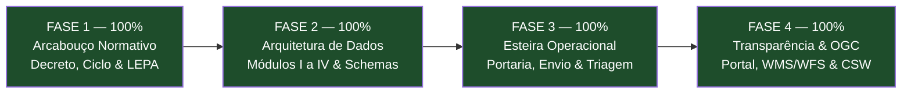
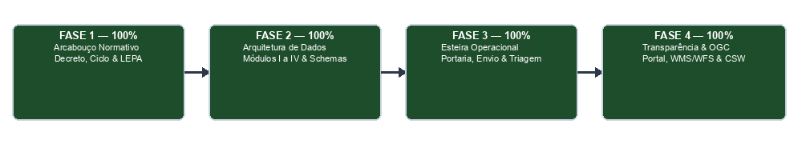

# Roadmap de Implementação do SEINUC/PA

Este documento apresenta a trajetória cronológica e sequencial para o desenvolvimento e consolidação da documentação técnica, legal e cadastral do **Sistema Estadual de Informações sobre Unidades de Conservação do Estado do Pará (SEINUC/PA)**.

---

## Visão Geral das Fases

---

## Detalhamento das Fases e Entregáveis

### Fase 1: Arcabouço Normativo Fundamental
**Status:** Concluído (100%)  
**Objetivo:** Normatizar a governança legal do SEINUC/PA, o ciclo de avaliação do ICMS Ecológico e as garantias processuais.

* [x] **Milestone 1.1:** Minuta do Decreto Regulamentador ([`minuta-decreto-seinuc.md`](producao/docs/minuta-decreto-seinuc.md)) — `T1`
* [x] **Milestone 1.2:** Definição do Ciclo Anual de Gestão e Cronograma de Prazos — `T2`
* [x] **Milestone 1.3:** Regulamentação da Comissão Técnica (CT-SEINUC) e Rito Recursal de 15 Dias Úteis (LEPA) — `T10`
* [x] **Milestone 1.4:** Normatização da Integração Trienal com ITERPA e SEMAS Licenciamento — `T7`
* [x] **Milestone 1.5:** Regulamentação do Relatório Quadrienal de Efetividade (Art. 113 da Lei nº 10.306/2023) — `T12`

---

### Fase 2: Arquitetura e Dicionário de Dados dos Módulos
**Status:** Concluído (100%)  
**Objetivo:** Especificar o Dicionário de Dados, esquemas JSON e regras de validação dos Módulos do SEINUC/PA com base nos padrões oficiais do IDEFLOR-Bio.

* [x] **Milestone 2.1:** Módulo I - Caracterização Ambiental, Biodiversidade e Clima ([`especificacao-modulos-dados-seinuc.md`](producao/docs/especificacao-modulos-dados-seinuc.md)) — `T4`
* [x] **Milestone 2.2:** Módulo II - Georreferenciamento, Delimitação e Zonas de Amortecimento ([`especificacao-modulos-dados-seinuc.md`](producao/docs/especificacao-modulos-dados-seinuc.md)) — `T5`
* [x] **Milestone 2.3:** Módulo III - Gestão, Governança, Aspectos Antropológicos e UCs Legadas ([`especificacao-modulos-dados-seinuc.md`](producao/docs/especificacao-modulos-dados-seinuc.md)) — `T6`
* [x] **Milestone 2.4:** Módulo IV - Caracterização Fundiária, Dominial e RPPNs ([`especificacao-modulos-dados-seinuc.md`](producao/docs/especificacao-modulos-dados-seinuc.md)) — `T5`
* [x] **Milestone 2.5:** Protocolo de Integração CNUC, ITERPA e SEMAS ([`especificacao-modulos-dados-seinuc.md`](producao/docs/especificacao-modulos-dados-seinuc.md)) — `T7`

---

### Fase 3: Regras Técnicas, Envio e Triagem
**Status:** Concluído (100%)  
**Objetivo:** Traduzir os módulos de dados em minuta de Portaria Técnica e instrumentos formais de recebimento e triagem.

* [x] **Milestone 3.1:** Minuta da Portaria Conjunta de Diretrizes Técnicas ([`minuta-portaria-diretrizes-tecnicas.md`](producao/docs/minuta-portaria-diretrizes-tecnicas.md)) — `T3`
* [x] **Milestone 3.2:** Protocolo Digital de Transmissão, Nomenclatura e SFTP ([`manual-fluxo-envio-e-triagem.md`](producao/docs/manual-fluxo-envio-e-triagem.md)) — `T8`
* [x] **Milestone 3.3:** Checklist de Triagem e Ficha de Admissibilidade Formal ([`manual-fluxo-envio-e-triagem.md`](producao/docs/manual-fluxo-envio-e-triagem.md)) — `T9`

---

### Fase 4: Transparência, Serviços OGC e Divulgação
**Status:** Concluído (100%)  
**Objetivo:** Regulamentar os serviços de publicação de dados abertos e interoperabilidade cartográfica estadual.

* [x] **Milestone 4.1:** Requisitos do Portal de Transparência e Geoserviços OGC (WMS/WFS) ([`especificacao-portal-transparencia-ogc.md`](producao/docs/especificacao-portal-transparencia-ogc.md)) — `T11`
* [x] **Milestone 4.2:** Consolidação e Fechamento da Documentação de Produção.

---
*Roadmap finalizado em conformidade integral com a Lei Estadual nº 10.306/2023.*
