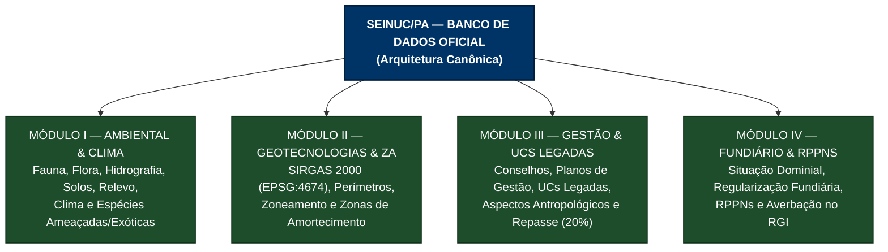
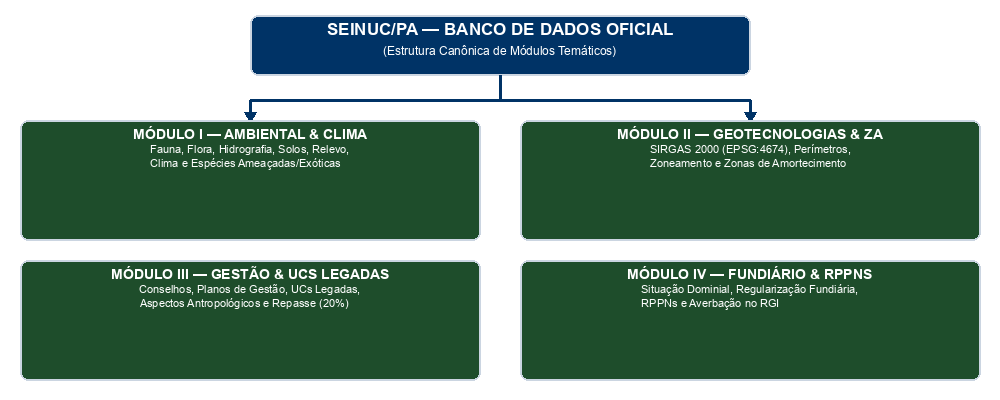

# ESPECIFICAÇÃO TÉCNICA E DICIONÁRIO DE DADOS DOS MÓDULOS DO SEINUC/PA

> **Documento Oficial de Especificação da Arquitetura de Informações do Sistema Estadual de Informações sobre Unidades de Conservação do Estado do Pará (SEINUC/PA)**
> **Base Legal:** Art. 67, § 2º e Art. 68, § 1º da Lei Estadual nº 10.306/2023 | Decreto Regulamentador do SEINUC/PA | Padrão Cartográfico Oficial do IDEFLOR-Bio

---

## 1. Apresentação e Estrutura dos Módulos

O presente documento estabelece o Dicionário de Dados, a estrutura de atributos espaciais, as regras de validação e os esquemas de integração (JSON Schema) para os quatro eixos temáticos que compõem o banco de dados oficial do SEINUC/PA.





---

## 2. Módulo I - Caracterização Ambiental, Biodiversidade e Clima (Quadro I)

### 2.1. Dicionário de Dados da Tabela de Atributos Ambiental

| Campo | Nome Técnico (ID) | Tipo de Dado | Obrigatório | Regra de Validação / Vocabulário Controlado |
| :--- | :--- | :---: | :---: | :--- |
| **Identificador da UC** | `uc_id` | Número (Inteiro) | Sim | Chave primária vinculada ao cadastro da UC. |
| **Código CNUC** | `cod_cnuc` | Texto (20) | Sim | Código oficial da UC no Cadastro Nacional de UCs (MMA). |
| **Bioma Predominante** | `bioma_predominante` | Enum (Texto) | Sim | `Amazônia`, `Cerrado`, `Zona Costeira/Marinho`. |
| **Fitofisionomia** | `fitofisionomia` | Lista (Array Texto) | Sim | Vocabulário IBGE: `Floresta Ombrófila Densa`, `Floresta Ombrófila Aberta`, `Manguezal`, `Campinarana`, `Restinga`, `Savana/Cerrado`, `Várzea`. |
| **Paisagem Predominante** | `paisagem_tipologia` | Texto | Sim | Descrição da fisionomia de paisagem natural e ecossistemas. |
| **Bacia Hidrográfica** | `bacia_hidrografica` | Enum (Texto) | Sim | Divisão Hidrográfica Estadual: `Bacia do Amazonas`, `Bacia do Tocantins-Araguaia`, `Bacia do Atlântico Nordeste Ocidental`. |
| **Principais Rios** | `rios_principais` | Texto (Livre) | Não | Nomes dos rios, igarapés e lagos de relevância no interior da UC. |
| **Relevo Predominante** | `relevo_tipologia` | Enum (Texto) | Sim | `Planície Aluvial`, `Planalto Rebaixado da Amazônia`, `Depressão Peramázonica`, `Serras e Chapadas`. |
| **Dados Climáticos** | `clima_caracterizacao` | Texto (Livre) | Sim | Classificação de Köppen, precipitação pluviométrica média e temperatura. |
| **Espécies Ameaçadas (Fauna)** | `fauna_ameacada` | Lista Objetos | Não | Nome científico, nome popular, Categoria IUCN/MMA (`CR`, `EN`, `VU`). |
| **Espécies Ameaçadas (Flora)** | `flora_ameacada` | Lista Objetos | Não | Nome científico, nome popular, Categoria IUCN/MMA (`CR`, `EN`, `VU`). |
| **Espécies Exóticas Invasoras** | `especies_exoticas` | Lista Objetos | Sim | Nome científico, grau de infestação, existência de Plano de Controle (Sim/Não). |
| **Programas de Pesquisa** | `programas_pesquisa` | Lista Objetos | Não | Projetos de pesquisa científica registrados na UC (Art. 67, § 4º da Lei). |

### 2.2. Esquema JSON de Validação (Módulo I)

```json
{
  "$schema": "https://json-schema.org/draft/2020-12/schema",
  "title": "ModuloCaracterizacaoAmbiental",
  "type": "object",
  "required": ["uc_id", "cod_cnuc", "bioma_predominante", "fitofisionomia", "paisagem_tipologia", "bacia_hidrografica", "relevo_tipologia", "clima_caracterizacao", "especies_exoticas"],
  "properties": {
    "uc_id": { "type": "integer" },
    "cod_cnuc": { "type": "string" },
    "bioma_predominante": {
      "type": "string",
      "enum": ["Amazônia", "Cerrado", "Zona Costeira/Marinho"]
    },
    "fitofisionomia": {
      "type": "array",
      "items": {
        "type": "string",
        "enum": ["Floresta Ombrófila Densa", "Floresta Ombrófila Aberta", "Manguezal", "Campinarana", "Restinga", "Savana/Cerrado", "Várzea"]
      },
      "minItems": 1
    },
    "paisagem_tipologia": { "type": "string" },
    "bacia_hidrografica": {
      "type": "string",
      "enum": ["Bacia do Amazonas", "Bacia do Tocantins-Araguaia", "Bacia do Atlântico Nordeste Ocidental"]
    },
    "rios_principais": { "type": "string" },
    "relevo_tipologia": {
      "type": "string",
      "enum": ["Planície Aluvial", "Planalto Rebaixado da Amazônia", "Depressão Peramázonica", "Serras e Chapadas"]
    },
    "clima_caracterizacao": { "type": "string" },
    "fauna_ameacada": {
      "type": "array",
      "items": {
        "type": "object",
        "required": ["nome_cientifico", "categoria_ameaca"],
        "properties": {
          "nome_cientifico": { "type": "string" },
          "nome_popular": { "type": "string" },
          "categoria_ameaca": { "type": "string", "enum": ["CR", "EN", "VU"] }
        }
      }
    },
    "flora_ameacada": {
      "type": "array",
      "items": {
        "type": "object",
        "required": ["nome_cientifico", "categoria_ameaca"],
        "properties": {
          "nome_cientifico": { "type": "string" },
          "nome_popular": { "type": "string" },
          "categoria_ameaca": { "type": "string", "enum": ["CR", "EN", "VU"] }
        }
      }
    },
    "especies_exoticas": {
      "type": "array",
      "items": {
        "type": "object",
        "required": ["nome_cientifico", "grau_infestacao", "possui_plano_controle"],
        "properties": {
          "nome_cientifico": { "type": "string" },
          "grau_infestacao": { "type": "string", "enum": ["Baixo", "Médio", "Alto", "Crítico"] },
          "possui_plano_controle": { "type": "boolean" }
        }
      }
    },
    "programas_pesquisa": {
      "type": "array",
      "items": {
        "type": "object",
        "required": ["titulo_pesquisa", "institucao"],
        "properties": {
          "titulo_pesquisa": { "type": "string" },
          "institucao": { "type": "string" }
        }
      }
    }
  }
}
```

---

## 3. Módulo II - Geotecnologias, Delimitação e Zonas de Amortecimento (Quadro II)

### 3.1. Padrão Geospacial e Atributos DBF (Padrão Oficial IDEFLOR-Bio)

* **Sistema de Referência de Coordenadas (Datum):** **SIRGAS 2000 (EPSG:4674)** - Coordenadas Geográficas.
* **Nota de Interoperabilidade GeoJSON:** O formato nativo de intercâmbio vetorial em SIRGAS 2000 é GeoPackage ou GML. O envio via GeoJSON (RFC 7946) será aceito mediante reprojeção/equivalência transparente pelo servidor do SEINUC.

| Nome da Coluna (Shapefile DBF) | Tipo | Tamanho | Precisão | Descrição do Atributo | Exemplo Real |
| :--- | :---: | :---: | :---: | :--- | :--- |
| `id` | N | 10 | 0 | Identificador numérico da feição | `1`, `2` |
| `cod_cnuc` | C | 20 | 0 | Código CNUC oficial (MMA) | `PA00001` |
| `nome_` | C | 254 | 0 | Nome oficial da UC | `Estação Ecológica do Grão-Pará (ESEC)` |
| `categoria` | C | 254 | 0 | Categoria estadual/federal | `ESEC`, `PARQUE ESTADUAL`, `APA`, `RESEX`, `RPPN`, `FLOTA`, `RESERVA ESTADUAL DE PESCA` |
| `grupo` | C | 50 | 0 | Grupo de Manejo SNUC | `Proteção Integral` ou `Uso Sustentável` |
| `cat_territ` | C | 254 | 0 | Descrição estendida territorial | `Unidade de conservação de proteção integral` |
| `municipio_` | C | 254 | 0 | Município(s) de abrangência | `Alenquer/MonteAlegre/Obidos/Oriximiná` |
| `data_de_cr` | C | 10 | 0 | Data do ato de criação (DD/MM/AAAA) | `04/12/2006` |
| `situacao_l` | C | 254 | 0 | Diploma legal de criação | `Decreto nº 2.609` |
| `area_ha` | N | 24 | 2 | Área calculada pelo GIS (Hectares) | `4245819.11` |
| `area_decre` | N | 24 | 2 | Área decretada oficial (Hectares) | `4245819.11` |
| `destinacao` | C | 254 | 0 | Situação da destinação pública | `Floresta Destinada` |
| `orgao_gest` | C | 254 | 0 | Órgão Gestor responsável | `IDEFLOR-Bio`, `Sema Municipal` |
| `tipo_flore` | C | 254 | 0 | Tipologia florestal | `TIPO A` |
| `za_delim` | C | 3 | 0 | Possui Zona de Amortecimento delimitada | `SIM` ou `NAO` |
| `zoneamento_disponivel` | C | 3 | 0 | Possui camada de zoneamento interno (depende da existência de Plano de Gestão aprovado) | `SIM` ou `NAO` |
| `obs` | C | 254 | 0 | Observações cartográficas | `Zona de Amortecimento delimitada` |

### 3.2. Camada de Zoneamento Interno (Atributos da Camada Geoespacial)

O **zoneamento interno** é uma **camada geográfica própria** (polígonos das zonas da UC), integrante do pacote vetorial do Módulo II, no mesmo Datum **SIRGAS 2000 (EPSG:4674)**. A camada de zoneamento **somente existe quando a UC possui Plano de Gestão aprovado** (`zoneamento_disponivel = SIM`, derivado de `plano_gestao_status = "Aprovado e Vigente"` no Módulo III); UCs sem plano de gestão transmitem apenas as camadas de perímetro e Zona de Amortecimento.

| Nome da Coluna (Shapefile DBF) | Tipo | Tamanho | Precisão | Descrição do Atributo | Exemplo Real |
| :--- | :---: | :---: | :---: | :--- | :--- |
| `id` | N | 10 | 0 | Identificador numérico da zona (chave da feição) | `1`, `2` |
| `zona` | C | 100 | 0 | Nome da zona do Plano de Gestão | `Zona Intangível`, `Zona Primitiva` |
| `area` | N | 24 | 2 | Área da zona em hectares (calculada pelo GIS) | `1234.56` |
| `sigla` | C | 20 | 0 | Sigla da zona | `ZI`, `ZP`, `ZUE` |
| `unidade` | C | 254 | 0 | Identificador da UC associada (`uc_id`/`cod_cnuc`) | `PA00001` |

**Regra de publicação:** nos geoserviços (WMS/WFS) e na Ficha da Unidade, a camada de zoneamento é **publicada apenas quando** `zoneamento_disponivel = SIM`; caso contrário, exibe-se aviso "UC sem Plano de Gestão — zoneamento não disponível", permanecendo visíveis apenas perímetro e Zona de Amortecimento.

### 3.3. Esquema JSON de Validação (Módulo II)

```json
{
  "$schema": "https://json-schema.org/draft/2020-12/schema",
  "title": "ModuloGeotecnologias",
  "type": "object",
  "required": ["id", "cod_cnuc", "nome_", "categoria", "grupo", "municipio_", "data_de_cr", "situacao_l", "area_ha", "area_decre", "za_delim"],
  "properties": {
    "id": { "type": "integer" },
    "cod_cnuc": { "type": "string" },
    "nome_": { "type": "string" },
    "categoria": { "type": "string" },
    "grupo": { "type": "string", "enum": ["Proteção Integral", "Uso Sustentável"] },
    "cat_territ": { "type": "string" },
    "municipio_": { "type": "string" },
    "data_de_cr": { "type": "string", "pattern": "^[0-9]{2}/[0-9]{2}/[0-9]{4}$" },
    "situacao_l": { "type": "string" },
    "area_ha": { "type": "number", "minimum": 0 },
    "area_decre": { "type": "number", "minimum": 0 },
    "destinacao": { "type": "string" },
    "orgao_gest": { "type": "string" },
    "tipo_flore": { "type": "string" },
    "za_delim": { "type": "string", "enum": ["SIM", "NAO"] },
    "zoneamento_disponivel": { "type": "string", "enum": ["SIM", "NAO"] },
    "obs": { "type": "string" }
  }
}
```

---

## 4. Módulo III - Gestão, Governança, Aspectos Antropológicos e UCs Legadas (Quadro III)

### 4.1. Dicionário de Dados da Tabela de Gestão

| Campo | Nome Técnico (ID) | Tipo de Dado | Obrigatório | Regra de Validação / Descrição |
| :--- | :--- | :---: | :---: | :--- |
| **Identificador da UC** | `uc_id` | Número (Inteiro) | Sim | Chave primária vinculada ao cadastro da UC. |
| **Possui Conselho Gestor** | `conselho_status` | Booleano (Sim/Não) | Sim | Indica a existência formal de Conselho Gestor. |
| **Tipo de Conselho** | `conselho_tipo` | Enum (Texto) | Não | `Consultivo`, `Deliberativo`. |
| **Ato de Criação do Conselho** | `conselho_ato_legal` | Texto (Livre) | Não | Número da Portaria/Decreto de criação do conselho. |
| **Reuniões no Ano-Base** | `conselho_reunioes_qtd` | Número (Inteiro) | Não | Mínimo de 2 reuniões ordinárias/extraordinárias comprovadas por ata para pontuação. |
| **Possui Plano de Gestão** | `plano_gestao_status` | Enum (Texto) | Sim | `Não Iniciado`, `Em Elaboração`, `Aprovado e Vigente`, `Em Revisão`. |
| **Ato de Aprovação do Plano** | `plano_gestao_ato` | Texto (Livre) | Não | Portaria/Decreto de aprovação do Plano de Gestão / Manejo. |
| **Data de Aprovação** | `plano_gestao_data` | Data (AAAA-MM-DD) | Não | Data da publicação do ato de aprovação. |
| **Status de UC Legada** | `legada_status` | Enum (Texto) | Sim | `Conforme Lei 10.306/2023`, `Sítio Pesqueiro em Adequação (Art. 112)`, `UC Criada em Legislação Anterior em Reavaliação (Art. 114)`. |
| **Prazo Final da UC Legada** | `legada_prazo_fim` | Data (AAAA-MM-DD) | Não | Data limite para reavaliação ou adequação (ex: 2028 no Art. 114 da Lei nº 10.306/2023). |
| **Aspectos Arqueológicos/Antropológicos**| `antropologico_caracterizacao` | Texto (Livre) | Não | Descrição de sítios arqueológicos, patrimônio cultural e terras comunitárias (Art. 68, §1º). |
| **Destinacao Mínima Municipal (Art. 117)**| `repasse_municipal_20pct` | Booleano (Sim/Não) | Sim | Rastreamento do cumprimento do repasse de 20% do ICMS a UCs municipais. |
| **Visitantes Anuais** | `visitantes_qtd` | Número (Inteiro) | Não | Estimativa ou contagem oficial de visitantes no ano-base. |
| **Receita de Uso Público** | `receita_arrecadada_brl` | Número (Decimal) | Não | Valor total arrecadado em R$ com bilheteria, serviços ou concessões. |
| **Gestor Responsável - Nome** | `gestor_responsavel_nome` | Texto (Livre) | Não | Nome do gerente/responsável pela gestão da UC (nível técnico - LGPD). |
| **Gestor Responsável - Cargo** | `gestor_responsavel_cargo` | Texto (Livre) | Não | Cargo/função do responsável pela UC. |
| **Gestor Responsável - E-mail** | `gestor_contato_email` | Texto (Livre) | Não | E-mail institucional de contato (nível técnico - LGPD). |
| **Ato de Designação do Gestor** | `gestor_nomeacao_ato` | Texto (Livre) | Não | Portaria/decreto de designação do gestor responsável. |
| **Composição do Conselho** | `conselho_composicao` | Lista Objetos | Não | Membros do conselho (nome institucional, segmento e mandato). |
| **Versão do Plano de Gestão** | `plano_gestao_versao` | Texto (Livre) | Não | Identificação da versão vigente do Plano de Gestão. |
| **Histórico/Estudos do Plano** | `plano_gestao_atualizacoes` | Texto (Livre) | Não | Histórico de atualizações e estudos complementares do Plano de Gestão. |
| **Projetos em Execução** | `projetos` | Lista Objetos | Não | Projetos e programas em execução (turismo, educação ambiental, recuperação, pesquisa etc.). |
| **Cooperações Vigentes** | `cooperacoes` | Lista Objetos | Não | Termos de Cooperação Técnica/convênios vigentes. |
| **Concessões e Processos Internos** | `concessoes` | Lista Objetos | Não | Concessões e processos internos (manejo florestal, restauração, PROSAF, visitação etc.). |
| **Estratégia Financeira** | `estrategia_financeira` | Texto (Livre) | Não | Resumo da estratégia financeira da UC (arts. 69-73 da Lei 10.306/2023). |
| **Recursos Disponíveis (R$)** | `recursos_disponiveis_brl` | Número (Decimal) | Não | Recursos financeiros disponíveis para a UC (nível técnico). |
| **Plano de Aplicação aprovado na CCA** | `plano_aplicacao_cca` | Texto (Livre) | Não | Planos de aplicação de recursos aprovados na Câmara de Compensação Ambiental (CCA). |

### 4.2. Esquema JSON de Validação (Módulo III)

```json
{
  "$schema": "https://json-schema.org/draft/2020-12/schema",
  "title": "ModuloGestaoEGovernança",
  "type": "object",
  "required": ["uc_id", "conselho_status", "plano_gestao_status", "legada_status", "repasse_municipal_20pct"],
  "properties": {
    "uc_id": { "type": "integer" },
    "conselho_status": { "type": "boolean" },
    "conselho_tipo": { "type": "string", "enum": ["Consultivo", "Deliberativo"] },
    "conselho_ato_legal": { "type": "string" },
    "conselho_reunioes_qtd": { "type": "integer", "minimum": 0 },
    "plano_gestao_status": {
      "type": "string",
      "enum": ["Não Iniciado", "Em Elaboração", "Aprovado e Vigente", "Em Revisão"]
    },
    "plano_gestao_ato": { "type": "string" },
    "plano_gestao_data": { "type": "string", "format": "date" },
    "legada_status": {
      "type": "string",
      "enum": ["Conforme Lei 10.306/2023", "Sítio Pesqueiro em Adequação (Art. 112)", "UC Criada em Legislação Anterior em Reavaliação (Art. 114)"]
    },
    "legada_prazo_fim": { "type": "string", "format": "date" },
    "antropologico_caracterizacao": { "type": "string" },
    "repasse_municipal_20pct": { "type": "boolean" },
    "visitantes_qtd": { "type": "integer", "minimum": 0 },
    "receita_arrecadada_brl": { "type": "number", "minimum": 0 },
    "gestor_responsavel_nome": { "type": "string" },
    "gestor_responsavel_cargo": { "type": "string" },
    "gestor_contato_email": { "type": "string", "format": "email" },
    "gestor_nomeacao_ato": { "type": "string" },
    "conselho_composicao": {
      "type": "array",
      "items": {
        "type": "object",
        "properties": {
          "nome_completo": { "type": "string" },
          "segmento": { "type": "string" },
          "mandato_inicio": { "type": "string", "format": "date" },
          "mandato_fim": { "type": "string", "format": "date" }
        }
      }
    },
    "plano_gestao_versao": { "type": "string" },
    "plano_gestao_atualizacoes": { "type": "string" },
    "projetos": {
      "type": "array",
      "items": {
        "type": "object",
        "properties": {
          "nome": { "type": "string" },
          "tipo": { "type": "string" },
          "status": { "type": "string" },
          "parceiro": { "type": "string" },
          "vigencia_inicio": { "type": "string", "format": "date" },
          "vigencia_fim": { "type": "string", "format": "date" }
        }
      }
    },
    "cooperacoes": {
      "type": "array",
      "items": {
        "type": "object",
        "properties": {
          "tipo": { "type": "string" },
          "objeto": { "type": "string" },
          "parceiro": { "type": "string" },
          "vigencia_fim": { "type": "string", "format": "date" }
        }
      }
    },
    "concessoes": {
      "type": "array",
      "items": {
        "type": "object",
        "properties": {
          "tipo": { "type": "string" },
          "objeto": { "type": "string" },
          "vigencia_fim": { "type": "string", "format": "date" }
        }
      }
    },
    "estrategia_financeira": { "type": "string" },
    "recursos_disponiveis_brl": { "type": "number", "minimum": 0 },
    "plano_aplicacao_cca": { "type": "string" }
  },
  "allOf": [
    {
      "if": {
        "properties": { "conselho_status": { "const": true } }
      },
      "then": {
        "required": ["conselho_reunioes_qtd"],
        "properties": {
          "conselho_reunioes_qtd": { "type": "integer", "minimum": 2 }
        }
      }
    }
  ]
}
```

---

## 5. Módulo IV - Caracterização Fundiária, Dominial e RPPNs (Quadro IV)

### 5.1. Dicionário de Dados Fundiário

| Campo | Nome Técnico (ID) | Tipo de Dado | Obrigatório | Descrição / Validação |
| :--- | :--- | :---: | :---: | :--- |
| **Identificador da UC** | `uc_id` | Número (Inteiro) | Sim | Chave primária vinculada ao cadastro da UC. |
| **Dominialidade** | `situacao_dominial` | Enum (Texto) | Sim | `Pública Estadual`, `Pública Federal`, `Pública Municipal`, `Privada em Regularização`. |
| **Percentual Regularizado** | `percentual_regularizado` | Número (Decimal) | Sim | Percentual acumulado de regularização fundiária da UC (0.00 a 100.00%). |
| **É RPPN** | `is_rppn` | Booleano | Sim | Indica se a unidade é Reserva Particular do Patrimônio Natural. |
| **Matrícula RGI (RPPN)** | `rppn_matricula_rgi` | Texto | Não | Número da matrícula do imóvel no Registro Geral de Imóveis (RGI). |
| **Averbação de Perpetuidade**| `rppn_averbacao_perpetuidade`| Booleano | Não | Comprovação da averbação da perpetuidade à margem da matrícula do imóvel. |

### 5.2. Esquema JSON de Validação (Módulo IV)

```json
{
  "$schema": "https://json-schema.org/draft/2020-12/schema",
  "title": "ModuloFundiarioERPPN",
  "type": "object",
  "required": ["uc_id", "situacao_dominial", "percentual_regularizado", "is_rppn"],
  "properties": {
    "uc_id": { "type": "integer" },
    "situacao_dominial": {
      "type": "string",
      "enum": ["Pública Estadual", "Pública Federal", "Pública Municipal", "Privada em Regularização"]
    },
    "percentual_regularizado": { "type": "number", "minimum": 0, "maximum": 100 },
    "is_rppn": { "type": "boolean" },
    "rppn_matricula_rgi": { "type": "string" },
    "rppn_averbacao_perpetuidade": { "type": "boolean" }
  }
}
```

---

## 6. Protocolo de Integração e Interoperabilidade Interinstitucional (Art. 11 a 13 do Decreto)

### 6.1. Protocolo de Integração com o CNUC/MMA (Art. 11 do Decreto)
Exportação dos dados cadastrais e vetoriais em conformidade com o Dicionário do Cadastro Nacional de Unidades de Conservação (CNUC), utilizando o código único `cod_cnuc`.

### 6.2. Repasse Trienal ao ITERPA e SEMAS Licenciamento (Art. 12 do Decreto e Art. 68, §4º da Lei)
Exportação trienal automatizada para instrução da arrecadação de terras devolutas (ITERPA - Art. 110) e restrições socioambientais no Licenciamento Ambiental (SEMAS).
