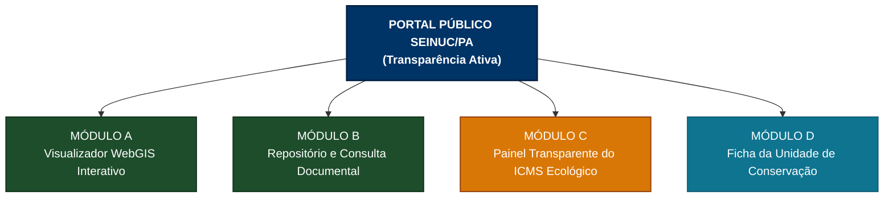
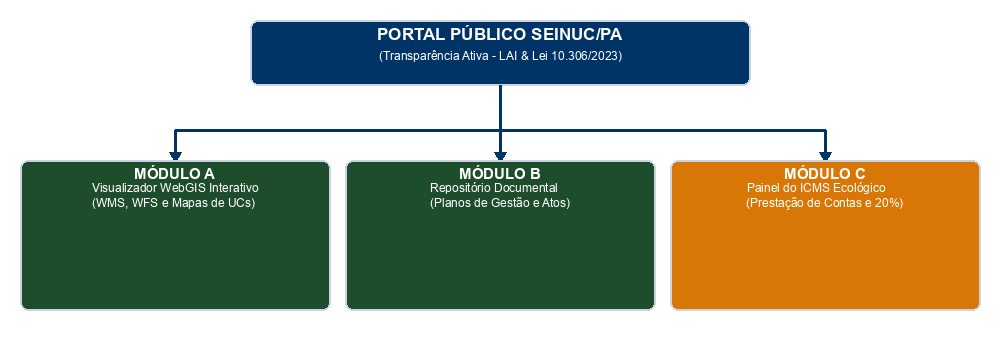

# ESPECIFICAÇÃO DO PORTAL DE TRANSPARÊNCIA E SERVIÇOS DE MAPAS OGC (SEINUC/PA)

> **Documento Oficial de Especificação Técnica e Regulamentação da Transparência Ativa e Geoserviços**
> **Base Legal:** Art. 67, § 6º e Art. 111 da Lei Estadual nº 10.306/2023 | Arts. 13 e 14 do Decreto Regulamentador do SEINUC/PA | Lei Federal nº 12.527/2011 (LAI) | Padrões OGC (Open Geospatial Consortium)

---

## 1. Apresentação e Objetivos

Este documento especifica os requisitos funcionais, a arquitetura de transparência ativa, as diretrizes de dados abertos e a infraestrutura de geoserviços nos padrões da *Open Geospatial Consortium (OGC)* do **Sistema Estadual de Informações sobre Unidades de Conservação do Estado do Pará (SEINUC/PA)**.

O objetivo precípuo consiste em garantir o controle social, a publicidade irrestrita das ações de conservação do patrimônio natural paraense e a obrigatoriedade de alimentação da **Cartografia Oficial do Estado do Pará** (Art. 111 da Lei nº 10.306/2023).

---

## 2. Arquitetura do Portal Público de Transparência Ativa

O Portal Público do SEINUC/PA será estruturado em quatro módulos integrados de livre acesso ao cidadão, pesquisadores e órgãos de controle, isentos de necessidade de cadastro prévio:

### 2.1. Módulo A - Visualizador WebGIS Interativo
* **Funcionalidade:** Interface cartográfica de alto desempenho para navegação espacial sobre as Unidades de Conservação estaduais, municipais e RPPNs.
* **Camadas de Informação Disponíveis:**
  * Polígonos de Perímetros Oficiais de UCs (Proteção Integral e Uso Sustentável).
  * Zonas de Amortecimento.
  * Zoneamento Ambiental Interno — **exibido apenas quando a UC possui Plano de Gestão aprovado** (`zoneamento_disponivel = SIM`, ver Módulo II); UCs sem plano de gestão exibem somente perímetro e Zona de Amortecimento.
  * Mosaicos de Áreas Protegidas e terras comunitárias limítrofes.
  * Camada de Hidrografia e Bacias Hidrográficas.
  * **Camadas de Referência Federais (ICMBio/INDE):** limites de Unidades de Conservação **federais** localizadas no Pará, consumidos por geoserviços de referência do órgão gestor federal (ver Anexo Técnico), sem duplicidade de armazenamento no SEINUC.
* **Ferramentas do Usuário:** Consulta por atributos, medição de áreas/distâncias, alternância de mapas de fundo (satélite/topográfico) e exportação de mapas em PDF.

### 2.2. Módulo B - Repositório e Consulta Documental
* **Funcionalidade:** Mecanismo de busca textual e download público de documentos oficiais vinculados às UCs.
* **Acervo Disponível:**
  * Atos Legais de Criação (Leis e Decretos).
  * Planos de Gestão (equivalentes ao plano de manejo federal — art. 2º, XXII, da Lei nº 10.306/2023) em formato PDF pesquisável.
  * Portarias de instituição e Atas de Reuniões dos Conselhos Gestores.
  * Fichas de Caracterização Ambiental e Resumos Executivos.

### 2.3. Módulo C - Painel Transparente do ICMS Ecológico
* **Funcionalidade:** Painel de prestação de contas dos repasses ambientais aos municípios paraense.
* **Dados Publicizados:**
  * Relação de municípios habilitados e indeferidos por exercício.
  * Extratos de Pontuação Provisória e Definitiva.
  * Fichas de Avaliação Técnica emitidas pela Comissão Técnica (CT-SEINUC).
  * Relatórios de Julgamento de Recursos Administrativos.
  * Rastreamento da destinação de ao menos 20% das verbas a UCs municipais (Art. 117 da Lei nº 10.306/2023).

### 2.4. Módulo D - Ficha da Unidade de Conservação

* **Funcionalidade:** "prontuário" individual de cada Unidade de Conservação, reunindo em uma única página todos os dados da UC para consulta pública fácil — de cada unidade, com acesso direto.
* **Estrutura da Ficha:**
  * **Cabeçalho da UC:** nome, categoria, grupo, bioma, área (ha), municípios, órgão gestor e **gestor responsável** (nome/cargo institucional — nível técnico, LGPD).
  * **Abas por Módulo:** Ambiental/Biodiversidade · Geotecnologias/Zonas de Amortecimento · Gestão (conselho + atas + Plano de Gestão) · Fundiária/Dominial e RPPNs.
  * **Mapa da unidade:** perímetro, Zona de Amortecimento, **zoneamento interno (quando disponível)** e **sobreposições com UCs federais (camada de referência ICMBio)**; download dos vetores em GPKG/GeoJSON.
  * **Documentos:** dossiê do processo de criação, Plano de Gestão (versões/estudos complementares), atas e portarias do conselho, e demais arquivos públicos.
  * **Conselho Gestor:** composição (membros, segmento e mandato), cronogramas e atas.
  * **Finanças & CCA:** estratégia financeira, recursos disponíveis e planos de aplicação aprovados na Câmara de Compensação Ambiental (nível técnico).
  * **Projetos, Cooperações e Concessões:** projetos/programas em execução, Termos de Cooperação Técnica e concessões (manejo, restauração, PROSAF, visitação).
  * **Linha do tempo:** evolução da UC (criação → consulta pública → plano → alterações) e status de prazos (arts. 112/114).
  * **Indicadores:** efetividade de gestão, visitação/receita e relatórios anuais/quadrienais (art. 113).
* **Níveis de Acesso e Salvaguardas:** a Ficha pública exibe apenas a **visão de consulta**; dados de espécies criticamente ameaçadas (CR) seguem **mascarados**; dados pessoais de gestores/conselheiros (CPF, telefone, endereço) e matrículas de RPPN ficam restritos ao **nível técnico** (LGPD e tutela da privacidade).

---

## 3. Geoserviços OGC e Integração com a Cartografia Oficial do Estado (Art. 111 da Lei 10.306/23 e Art. 13 do Decreto)

Em estrito cumprimento ao **Art. 111 da Lei Estadual nº 10.306/2023** e ao **Art. 13 do Decreto Regulamentador**, as bases de dados geográficos do SEINUC/PA serão disponibilizadas por ciclo anual (com atualização contínua intra-ciclo) via geoserviços padronizados pela *Open Geospatial Consortium (OGC)* para consumo obrigatório pelos geoportais oficiais do Estado do Pará (SIEPA, ITERPA, SEMAS e SEFA).

### 3.1. Especificação dos Geoserviços OGC

| Serviço OGC | Versão Padrão | Endpoint de Acesso | Finalidade e Aplicação na Cartografia Oficial |
| :--- | :---: | :--- | :--- |
| **WMS (Web Map Service)** | 1.3.0 | `https://seinuc.ideflor.pa.gov.br/geoserver/wms` | Renderização de mapas dinâmicos e camadas visuais das UCs na confecção das cartas e mapas oficiais do Governo do Estado do Pará. |
| **WFS (Web Feature Service)** | 2.0.0 | `https://seinuc.ideflor.pa.gov.br/geoserver/wfs` | Download e consumo de vetores brutos em formatos abertos (`GeoJSON`, `Shapefile zip`, `KML`) por órgãos ambientais, pesquisadores e sistemas parceiros. |
| **WCS (Web Coverage Service)** | 2.0.1 | `https://seinuc.ideflor.pa.gov.br/geoserver/wcs` | Transmissão de dados raster e modelos digitais de elevação de UCs quando aplicável. |
| **CSW (Catalog Service for the Web)** | 2.0.2 | `https://seinuc.ideflor.pa.gov.br/geoserver/csw` | Descoberta e catálogo estandardizado de metadados geográficos junto à INDE. |

### 3.2. Padrão de Metadados Geográficos (Perfil MGB / INDE)
Todos os conjuntos de dados geográficos do SEINUC/PA serão catalogados segundo o **Perfil de Metadados Geográficos do Brasil (MGB)** da Infraestrutura Nacional de Dados Espaciais (INDE), contendo:
* Linhagem e histórico do dado vetorial e UUID do conjunto de dados.
* Sistema de Referência: SIRGAS 2000 (EPSG:4674).
* Responsável técnico pelo mapeamento e periodicidade de atualização.

---

## 4. Diretrizes de Sigilo, Proteção da Biodiversidade, LGPD e SisGen (Art. 14 do Decreto)

A transparência pública no SEINUC/PA observará as ressalvas legais de proteção ao patrimônio biológico, à privacidade e ao patrimônio genético, nos termos do Art. 14 do Decreto Regulamentador, da Lei Geral de Proteção de Dados (Lei Federal nº 13.709/2018) e da Lei da Biodiversidade (Lei Federal nº 13.123/2015):

### 4.1. Resguardo da Biodiversidade (Proteção contra Biopirataria)
* **Regra de Mascaramento Espacial:** As coordenadas geográficas exatas de pontos de nidificação, avistamento ou ocorrência de espécies da fauna e flora criticamente ameaçadas de extinção (CR) suscetíveis à caça, ilícito ou biopirataria serão mascaradas no visualizador público e nos endpoints OGC.
* **Visualização Generalizada em Todos os Geoserviços:** Para o público geral, o dado de ocorrência sensível será exibido nos geoserviços públicos (WebGIS, WMS, WFS e WCS) por polígono de quadrícula regional generalizada (10 x 10 km), aplicando-se o mesmo filtro de generalização às requisições de consulta puntiforme (*GetFeatureInfo* e *GetFeature*), mantendo a precisão exata restrita ao corpo técnico autorizado da SEMAS e IDEFLOR-Bio.

### 4.2. Conformidade com a LGPD
* A Secretaria de Estado de Meio Ambiente e Sustentabilidade (SEMAS) atua na condição de **Controladora** dos dados e o IDEFLOR-Bio como **Operador**.
* Os dados pessoais de conselheiros civis ou gestores (CPF, telefone pessoal, endereço residencial) serão tarjados e anonimizados nos documentos públicos colocados para download, preservando-se a identificação institucional e o nome completo.

### 4.3. Conformidade com a Lei do Patrimônio Genético (SisGen)
* As informações relativas a acessos ao patrimônio genético e conhecimento tradicional associado em Unidades de Conservação observarão as salvaguardas da Lei Federal nº 13.123/2015 e os registros oficiais do Sistema Nacional de Gestão do Patrimônio Genético e do Conhecimento Tradicional Associado (SisGen).

---

## 5. Anexo Técnico — Fontes de Referência e Regras de Publicação

### 5.1. Camadas de Referência Federais (ICMBio/INDE)

As Unidades de Conservação **federais** localizadas no Pará **não integram o banco oficial do SEINUC** (o art. 67 da Lei nº 10.306/2023 trata das UCs estaduais); são exibidas como **camadas de referência** consumidas dos geoserviços públicos do órgão gestor federal:

| Serviço | Versão | Endpoint (GetCapabilities) |
| :-- | :--: | :-- |
| **WFS ICMBio** | 2.0.0 | `https://geoservicos.inde.gov.br/geoserver/ICMBio/ows?service=wfs&version=2.0.0&request=GetCapabilities` |
| **WMS ICMBio** | 1.3.0 | `https://geoservicos.inde.gov.br/geoserver/ICMBio/ows?service=wms&version=1.3.0&request=GetCapabilities` |

* **Aplicação:** camada de fundo no Módulo A e destaque de "sobreposição com UC federal" na Ficha da Unidade (Módulo D).
* **Ressalva técnica:** por serem fontes externas, recomenda-se **cache local** com política de atualização e mecanismo de *fallback* em caso de indisponibilidade da INDE.

### 5.2. Regra de Publicação do Zoneamento

A camada de zoneamento interno será publicada nos geoserviços (WMS/WFS) e na Ficha da Unidade **somente quando** `zoneamento_disponivel = SIM` (a UC possui Plano de Gestão aprovado). Nas UCs sem Plano de Gestão, permanecem visíveis apenas o perímetro e a Zona de Amortecimento, com a indicação **"UC sem Plano de Gestão — zoneamento não disponível"**.
