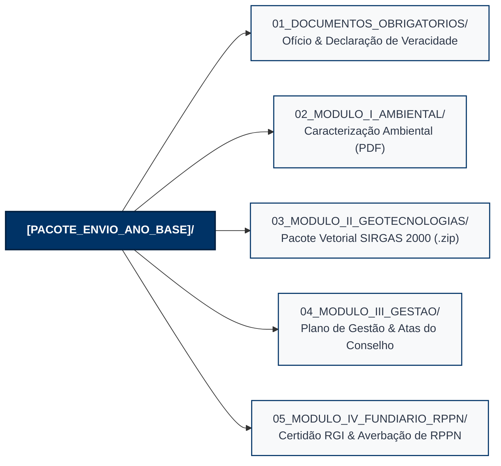
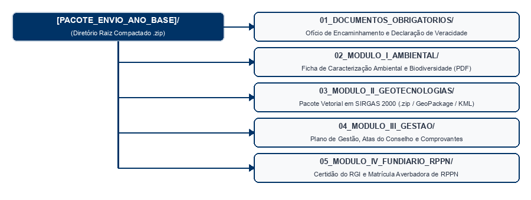
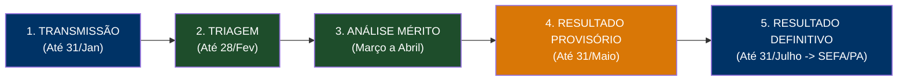
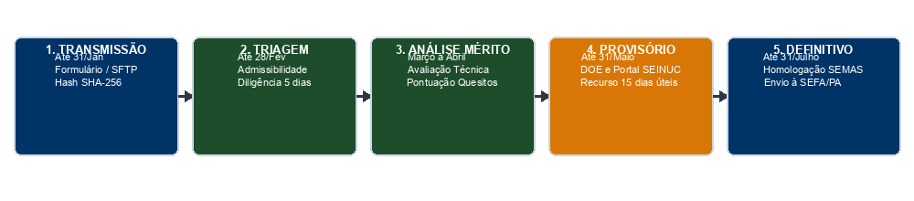

# MANUAL DE PROTOCOLO DIGITAL, FLUXO DE ENVIO E CHECKLIST DE TRIAGEM (SEINUC/PA)

> **Documento Oficial de Instrução Operacional do Sistema Estadual de Informações sobre Unidades de Conservação do Estado do Pará (SEINUC/PA)**
> **Base Legal:** Arts. 5º, 6º, 7º, 8º e 9º do Decreto Regulamentador do SEINUC/PA | Portaria Conjunta SEMAS/IDEFLOR-Bio nº ____/202X

---

## 1. Apresentação e Objetivos

Este manual estabelece os procedimentos operacionais para a transmissão digital de arquivos, a infraestrutura de recepção, a emissão do recibo de protocolo com autenticação de integridade e o **Checklist de Triagem (Admissibilidade Formal)** aplicado pela Comissão Técnica de Avaliação do SEINUC (CT-SEINUC).

---

## 2. Estrutura de Diretórios do Pacote de Envio Digital

Os gestores deverão organizar o pacote digital de transmissão obedecendo à seguinte estrutura padronizada de diretórios:

---

## 3. Canais de Transmissão e Recibo com Hash SHA-256 e Selo de Tempo

### 3.1. Canais de Transmissão
* **Portal Web do SEINUC/PA:** Envio direto via formulário eletrônico autenticado para pacotes de até 200 MB por Unidade de Conservação.
* **Servidor SFTP Institucional:** Servidor seguro para recepção de acervos pesados e arquivos vetoriais.

### 3.2. Recibo Eletrônico de Protocolo
Ao finalizar a transmissão, o sistema emitirá automaticamente o **Comprovante de Protocolo Digital**, contendo:
* Número do Protocolo Único de Entrada (`ANO-MUNICIPIO-SEINUC-Nº`).
* Data e Hora exatas do servidor oficial (Horário de Brasília) com carimbo de tempo.
* Relação nominal de arquivos transmitidos.
* **Código Hash SHA-256 e Selo de Tempo ICP-Brasil**, garantindo a integridade e a rastreabilidade do pacote transmitido.

---

## 4. Checklist de Triagem e Admissibilidade Formal

Antes da análise de mérito da documentação pela equipe técnica, o processo será submetido à **Triagem de Admissibilidade Formal**. O descumprimento de qualquer item eliminatório sem a devida justificativa formal enseja a rejeição sumária do protocolo.

### Tabela de Verificação (Checklist de Triagem)

| Item | Critério de Admissibilidade Formal | Caráter | Condição de Aceite | Ação em Caso de Descumprimento |
| :--- | :--- | :---: | :---: | :--- |
| **01** | **Prazo Regulamentar:** Transmissão realizada até 31/Jan do Ano de Exercício | Eliminatório | Data <= 31/Jan | Rejeição Sumária por Intempestividade (salvo prorrogação automática ou justificativa de força maior apresentada em até 2 dias úteis). |
| **02** | **Ofício de Encaminhamento:** Anexado e assinado por autoridade competente | Eliminatório | Presente e Assinado | Rejeição Sumária do Protocolo. |
| **03** | **Declaração de Veracidade:** Modelo Anexo I assinado digitalmente (Gov.br/ICP) | Eliminatório | Presente e Válida | Rejeição Sumária do Protocolo. |
| **04** | **Padrão PDF/OCR e Nomenclatura:** Arquivos textuais pesquisáveis e nomeação | Sanável | OCR e Sintaxe Válidos | Notificação para Diligência em 5 (cinco) dias úteis. |
| **05** | **Padrão Vetorial (Datum e Topologia):** Geometrias em SIRGAS 2000 (EPSG:4674) | Eliminatório (Datum) / Sanável (Topologia) | Datum SIRGAS 2000 e fecho topológico | Rejeição Sumária por Datum incompatível. Notificação para Diligência em 5 (cinco) dias úteis se houver apenas inconformidades topológicas sanáveis. |
| **06** | **Nomenclatura Oficial:** Arquivos nomeados segundo o padrão oficial da Portaria | Sanável | Sintaxe Correta | Notificação para Diligência em 5 (cinco) dias úteis. |
| **07** | **Averbação de RPPN:** Certidão de RGI anexada (quando aplicável) | Eliminatório | Matrícula Válida | Glosa da Pontuação de RPPN. |

---

## 5. Ficha Eletrônica de Aceite Preliminar

O parecerista técnico registrará no SEINUC/PA a deliberação da triagem:
* `HABILITADO PARA ANÁLISE DE MÉRITO` — Todos os itens 01 a 07 em conformidade.
* `NOTIFICADO PARA DILIGÊNCIA (5 DIAS ÚTEIS)` — Vícios formais sanáveis (ex: erro de OCR, nomenclatura de arquivos ou documentos complementares secundários), nos termos do Art. 8º, I do Decreto Regulamentador.
* `INDEFERIDO SUMARIAMENTE` — Intempestividade não justificada ou ausência de Ofício ou Declaração de Veracidade.

---

## 6. Fluxo Operacional Anual de Envio, Avaliação e Homologação

