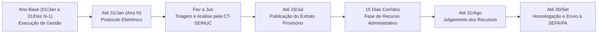

# EPIC1-T2: Definição do Ciclo Anual de Gestão (Cronograma Operacional)

**Status:** Concluído  
**Normatizado em:** Arts. 4º, 5º, 7º, 8º e 9º do Decreto Regulamentador ([`producao/docs/minuta-decreto-seinuc.md`](file:///H:/Meu%20Drive/IDEFLOR/SEINUC/producao/docs/minuta-decreto-seinuc.md))  
**Responsável:** Coordenação SEINUC / IDEFLOR-Bio  
**Base Legal:** Art. 4º, I e Capítulo III da Minuta do Decreto SEINUC/PA | Lei Estadual nº 7.638/2012 (ICMS Ecológico)

---

## 1. Rito Temporal e Calendário Regulamentado pelo Decreto

Conforme estabelecido nos Arts. 4º a 9º do Decreto Regulamentador do SEINUC/PA, o ciclo anual é composto pelas seguintes janelas e prazos vinculantes:

---

## 2. Prazos e Competências Consolidadas

1. **Ano-Base (N-1):** Período de 01 de janeiro a 31 de dezembro dedicado à execução das ações de gestão, conselhos, inventários e fiscalização nas UCs.
2. **Protocolo Eletrônico (Até 31 de Janeiro do Ano N):** Transmissão digital dos documentos com OCR e vetores SIRGAS 2000, acompanhada da Declaração de Veracidade.
3. **Análise Técnica (Fevereiro a Junho):** Exame dos processos pela Comissão Técnica de Avaliação (CT-SEINUC/IDEFLOR-Bio).
4. **Publicação Provisória (Até 15 de Julho):** Divulgação em Diário Oficial do Estado e Portal SEINUC.
5. **Fase Recursal (15 Dias Corridos):** Prazo peremptório para impugnação de notas ou indeferimentos.
6. **Julgamento e Homologação (Até 30 de Setembro):** Julgamento final e envio do índice definitivo de repasse à SEFA/PA.
