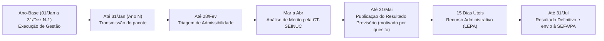

# EPIC1-T2: Definição do Ciclo Anual de Gestão (Cronograma Operacional)

**Status:** Concluído  
**Normatizado em:** Capítulo III e Arts. 8º a 10 do Decreto Regulamentador ([`producao/docs/minuta-decreto-seinuc.md`](../producao/docs/minuta-decreto-seinuc.md))  
**Responsável:** Coordenação SEINUC / SEMAS e IDEFLOR-Bio  
**Base Legal:** Arts. 5º a 10 da Minuta do Decreto SEINUC/PA | Lei Estadual nº 7.638/2012 (ICMS Ecológico) | Decreto Estadual nº 1.064/2020 (calendário do ICMS Verde)

---

## 1. Rito Temporal e Calendário Regulamentado pelo Decreto

Conforme estabelecido nos Arts. 5º a 10 do Decreto Regulamentador do SEINUC/PA, o ciclo anual é síncrono com o calendário do ICMS Verde (Decreto Estadual nº 1.064/2020):

---

## 2. Prazos e Competências Consolidadas

1. **Ano-Base (N-1):** Período de 01 de janeiro a 31 de dezembro dedicado à execução das ações de gestão, conselhos, inventários e fiscalização nas UCs.
2. **Transmissão (Até 31 de Janeiro do Ano N):** Envio digital dos documentos com OCR, vetores SIRGAS 2000 e Declaração de Veracidade. Contingência por indisponibilidade do portal (24h) e justificativa de força maior em até 2 dias úteis.
3. **Triagem de Admissibilidade (Até 28 de Fevereiro):** Verificação formal pela CT-SEINUC, com notificação para saneamento de vícios sanáveis em 5 dias úteis.
4. **Análise de Mérito (Março a Abril):** Exame pelos técnicos da CT-SEINUC e emissão das Fichas de Avaliação.
5. **Publicação Provisória (Até 31 de Maio):** Divulgação no DOE e no Portal SEINUC, sincronizada ao ICMS Verde (Decreto 1.064/2020), com Ficha motivada por quesito.
6. **Fase Recursal (15 Dias Úteis):** Prazo peremptório, contado em dias úteis (art. 83 da LEPA), com efeito suspensivo na parcela impugnada.
7. **Julgamento e Homologação (Até 31 de Julho):** Decisão final do titular da SEMAS e envio do índice definitivo à SEFA/PA.