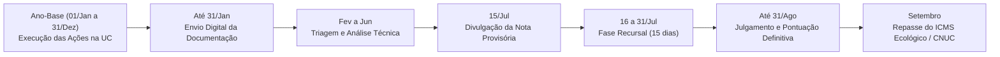

# EPIC1-T2: Definição do Ciclo Anual de Gestão (Cronograma Operacional)

**Status:** 🟡 **EM ABERTO**  
**Responsável:** Coordenação SEINUC / IDEFLOR-Bio  
**Base Legal:** Art. 4º, I da Minuta do Decreto SEINUC/PA | Benchmark IEPHA/MG (Deliberação Normativa CONEP)

---

## 📅 Definição do Rito Temporal do SEINUC

Para garantir a previsibilidade jurídica e técnica no monitoramento das Unidades de Conservação e no cálculo dos repasses do **ICMS Ecológico**, o SEINUC operará em um ciclo anual dividido entre **Ano-Base** e **Ano de Exercício**.

---

## 🎯 Subtarefas de Execução

### Subtarefa 1: Caracterização dos Períodos
* **Ano-Base (Ano N-1):** Período compreendido entre **01 de janeiro e 31 de dezembro** em que as ações de gestão, fiscalização, reuniões de conselho e inventários são efetivamente executadas na UC.
* **Ano de Exercício (Ano N):** Ano civil subsequente, dedicado ao protocolo, análise, pontuação, recurso e integração dos dados para efeito do ICMS Ecológico.

### Subtarefa 2: Detalhamento do Calendário Anual
1. **01 de Dezembro a 31 de Janeiro:** Abertura da janela de transmissão digital dos relatórios, cadastros e vetores pelos municípios/gestores.
2. **01 de Fevereiro a 30 de Junho:** Fase de Triagem e Análise Técnica pelas equipes do IDEFLOR-Bio/SEMAS com emissão de Fichas de Avaliação.
3. **15 de Julho:** Publicação do Extrato Preliminar de Habilitação e Pontuação Provisória em Diário Oficial e Portal SEINUC.
4. **16 a 30 de Julho (15 dias corridos):** Prazo para interposição de Recursos Administrativos contra o resultado provisório.
5. **01 a 31 de Agosto:** Julgamento dos recursos pela Comissão Técnica / COEMA e consolidação da Pontuação Definitiva.
6. **30 de Setembro:** Envio do índice definitivo à Secretaria de Estado de Fazenda (SEFA/PA) para cálculo do ICMS Ecológico e transmissão automatizada ao CNUC/MMA.

### Subtarefa 3: Minuta da Resolução de Calendário Operacional
Elaboração do texto normativo complementar especificando que prazos que vencerem em finais de semana ou feriados serão prorrogados até o primeiro dia útil subsequente.
